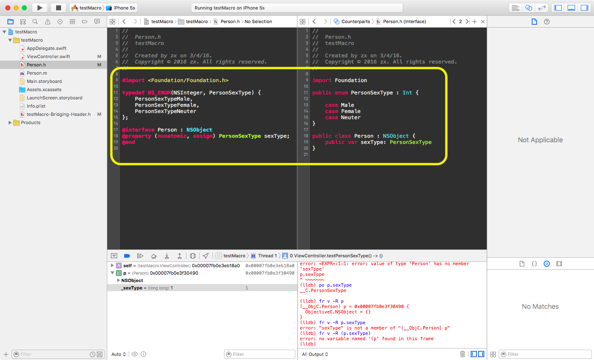

[TOC]

## Q1: typedef NS_ENUM

OC中的枚举被转换成了swif中的枚举:


```objective-c
typedef NS_ENUM(NSInteger, PersonSexType) {
    PersonSexTypeMale,
    PersonSexTypeFemale,
    PersonSexTypeNeuter
};
```

```swift


public enum PersonSexType : Int { 
    case Male
    case Female
    case Neuter
}

public class Person : NSObject {
    public var sexType: PersonSexType
}

```

 


## Q2: 复杂的宏改何去何从?


> Complex Macros
>
> Complex macros are used in C and Objective-C but **have no counterpart** in Swift.(不兼容) Complex macros are macros that do not define constants, including parenthesized, function-like macros. You use complex macros in C and Objective-C to avoid type-checking constraints or to avoid retyping large amounts of boilerplate code. However, macros can make debugging and refactoring difficult. **In Swift, you can use functions and generics to achieve the same results without any compromises.**(替代方法就是使用函数和泛型手段实现这些宏的功能) Therefore, the complex macros that are in C and Objective-C source files are not made available to your Swift code.
>
> > https://developer.apple.com/library/ios/documentation/Swift/Conceptual/BuildingCocoaApps/InteractingWithCAPIs.html#//apple_ref/doc/uid/TP40014216-CH8-XID_20


### A1: 使用函数替换宏

在OC中:

```objective-c
#define SQUARE_NUMBER(n) n * n		
```

 在swift中

```swift
func squareNumber(n: Int) -> Int {
    return n * n
}
```


### A2: 稍微多几个参数的宏定义

在OC中:

```objective-c
#define SQUARE_NUMBER(n) n * n

#define UIColorFromRGB(rgbValue, alphaValue) \
[UIColor colorWithRed:((float)((rgbValue >> 16) & 0xFF))/255.0 \
green:((float)((rgbValue >> 8) & 0xFF))/255.0 \
blue:((float)((rgbValue >> 0) & 0xFF))/255.0 \
alpha:alphaValue]


@interface Person : NSObject
-(void)printColor;
@end

@implementation Person

-(void)printColor{
    NSLog(@"%@",UIColorFromRGB(0xffeedd,0.5));
}
@end	
```

然后呢,在swif只是可以使用`printColor`这个方法:

```swift
 let p =  Person()
  p.printColor()
  
  /*
  testMacro[5226:193263] UIDeviceRGBColorSpace 1 0.933333 0.866667 0.5
  */
```

但是并不能直接使用UIColorFromRGB(0xffeedd,0.5)这样.


解决方法,写成一个函数咯:


```swift
func UIColorFromRGB(rgb: Int, alpha: Float) -> UIColor {
    let red = CGFloat(Float(((rgb>>16) & 0xFF)) / 255.0)
    let green = CGFloat(Float(((rgb>>8) & 0xFF)) / 255.0)
    let blue = CGFloat(Float(((rgb>>0) & 0xFF)) / 255.0)
    let alpha = CGFloat(alpha)

    return UIColor(red: red, green: green, blue: blue, 
    alpha: alpha)
}

func testMacroReplacement2(){
    print(UIColorFromRGB(0xffddee, alpha: 0.5))
}
testMacroReplacement2()	
```


